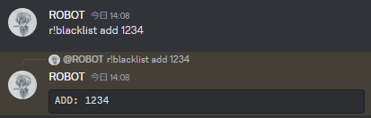
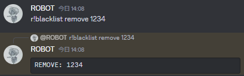

# GroupDM Spam Protector

## How to use

### Step1

```console
npm run build
```

### Step2

Create an .env file and copy the contents of .env.example.

Then change the variables.

### Step3

```
npm start
```

### Step4

use commands

#### r!blacklist add



<small>You will leave the group DM that you and that person are in now, and you will automatically leave the group DM if that person is added in the future.</small>

#### r!blacklist remove



<small>Remove the target user from the blacklist.</small>
